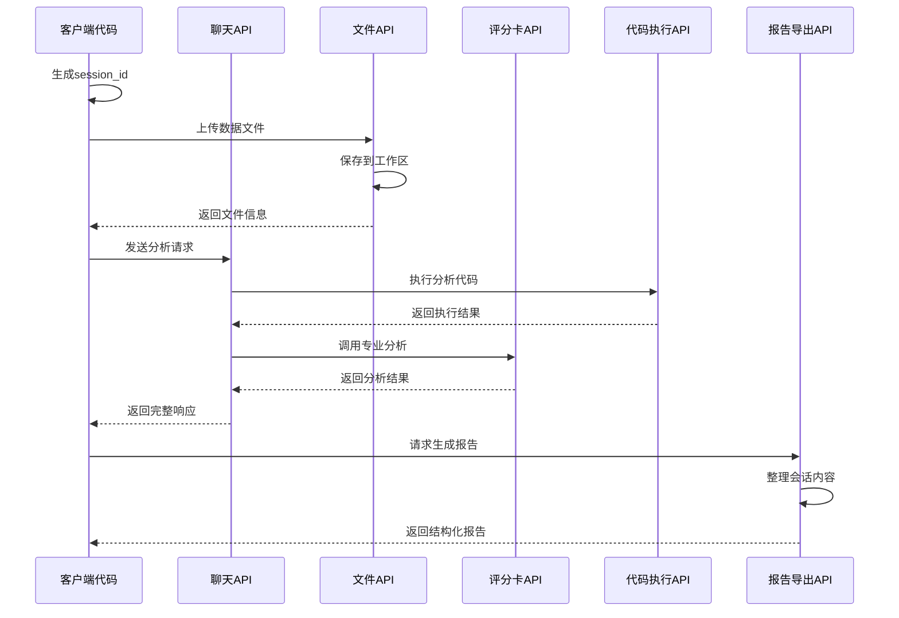
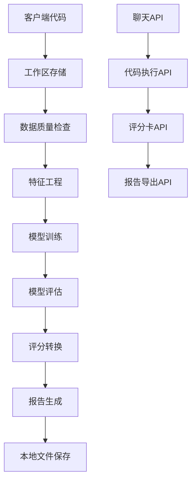

# 评分卡建模工作流程 - 完整数据分析业务场景

## 概述

本文档基于DeepAnalyze平台的核心业务功能，展示了一个完整的评分卡建模工作流程，从原始数据上传到最终业务报告生成的全过程。该工作流程适用于金融风险管理领域的信用评分建模项目。

### 两种使用方式

DeepAnalyze 提供两种使用方式，满足不同用户群体的需求：

| 方式 | 适用人群 | 特点 |
|------|----------|------|
| **🖥️ WebUI 交互模式** | 业务分析师、风控人员 | 界面点击操作，无需编写代码 |
| **🚀 API 编程模式** | 数据科学家、开发者 | 程序化调用，支持自动化集成 |

> 📌 **推荐**：新手用户建议从 WebUI 模式入门，熟悉流程后可进阶到 API 模式实现自动化。

---

## 执行模式与智能入口

### 交互模式选择

在 WebUI 中启动任务时，可以选择不同的**交互模式**：

| 交互模式 | 说明 | 适用场景 |
|----------|------|----------|
| **🚀 自动模式 (auto)** | 一键执行全部阶段，无需中途确认 | 标准场景、批量处理、信任默认流程 |
| **🔍 专家模式 (expert)** | 每个阶段执行完成后暂停，等待用户确认 | 需要审核中间结果、调试、学习流程 |

```
┌─────────────────────────────────────────────────┐
│ 📊 评分卡开发任务                        [收起]│
│ ───────────────────────────────────────────── │
│                                                 │
│  数据文件: [credit_data.csv ▼]                 │
│  目标变量: [is_bad ▼]                          │
│  基准分:   [600]                PDO: [20]      │
│                                                 │
│  ─────────────── 交互模式 ───────────────────  │
│  ● 🚀 自动模式    ○ 🔍 专家模式               │
│  ─────────────────────────────────────────────  │
│                                                 │
│  [重置参数]                    [🚀 开始执行]   │
└─────────────────────────────────────────────────┘
```

### 专家模式操作流程

选择**专家模式**后，任务执行流程如下（共7个阶段）：

```
┌──────────┐    ┌──────────┐    ┌──────────┐    ┌──────────┐    ┌──────────┐
│  阶段1   │    │  暂停    │    │  阶段2   │    │  暂停    │    │  阶段3   │
│ 数据加载 │───▶│ 等待确认 │───▶│ WOE分箱  │───▶│ 等待确认 │───▶│ 特征筛选 │ ···
└──────────┘    └──────────┘    └──────────┘    └──────────┘    └──────────┘
                     │                               │
                     ▼                               ▼
              用户查看输出                     用户查看输出
              点击"继续"                       点击"继续"

后续阶段：阶段4 模型训练 → 阶段5 评分转换 → 阶段6 模型评估 → 阶段7 报告生成
```

**评分卡开发7阶段说明**：

| 阶段 | ID | 名称 | 说明 |
|------|-----|------|------|
| 1 | data_loading | 数据加载 | 数据读取、缺失值处理、数据分割 |
| 2 | woe_binning | WOE分箱 | 变量分箱、WOE/IV计算 |
| 3 | feature_selection | 特征筛选 | IV筛选、VIF检验、相关性过滤 |
| 4 | model_training | 模型训练 | **逐步回归**、逻辑回归建模、**显著性检验**、**系数方向验证**、**迭代验证循环** |
| 5 | score_scaling | 评分转换 | 评分刻度转换、评分卡生成、**评分↔概率转换器** |
| 6 | model_evaluation | 模型评估 | KS/AUC计算、分数分布分析 |
| 7 | report_generation | 报告生成 | 汇总结果、生成可视化报告、**Excel报告导出** |

> **v4.3 架构调整**：逐步回归、显著性检验、系数方向验证已从阶段3（特征筛选）迁移至阶段4（模型训练），并新增迭代验证循环机制。

**专家模式下的界面交互**：

1. **阶段执行完成**：系统自动暂停，显示当前阶段的输出结果
2. **查看阶段输出**：右侧面板展示阶段代码和执行结果
3. **🤖 AI 智能分析**（自动触发）：系统调用 LLM 分析阶段输出，生成参数优化建议（SUGGESTED_PARAMS），以建议卡片形式展示在阶段输出上方
4. **💡 AI 建议操作**：可选择「仅填入」（将建议参数填入配置面板）或「填入并重试」（填入参数后自动从当前阶段重新执行，已完成阶段结果缓存复用，无需重跑）
5. **📸 版本快照**：每次重试自动保存历史版本（参数+输出+AI分析），可在顶部版本选择器中切换对比 v1/v2/v3
6. **确认继续**：点击「继续执行」按钮进入下一阶段

```
┌─────────────────────────────────────────────────┐
│ 📊 评分卡开发 - 阶段 2/7: WOE分箱               │
│ ████████████░░░░░░░░░░░░ 29%                    │
│ ───────────────────────────────────────────── │
│ ✅ 阶段2完成，已完成 8 个变量的WOE分箱          │
│                                                 │
│ ┌─ 🤖 AI 建议 ──────────────────────────────┐ │
│ │ 💡 当前分箱方法为等频，IV 均值 0.18        │ │
│ │    建议切换为卡方分箱可提升 IV 至 0.22+    │ │
│ │                                            │ │
│ │ [📝 仅填入]  [🚀 填入并重试]               │ │
│ └────────────────────────────────────────────┘ │
│                                                 │
│ 📸 版本历史: [v1] [v2]                         │
│                                                 │
│ [查看详情]              [▶ 继续执行下一阶段]   │
└─────────────────────────────────────────────────┘
```

### 🤖 LLM 智能入口（Chat 方式）

除了通过参数面板配置任务，还可以通过**自然语言对话**触发评分卡开发任务。这是一种**半自动模式**：LLM 解析参数后，用户需确认才开始执行。

**使用方式**：在中间对话区直接输入需求描述

```
┌─────────────────────────────────────────────────┐
│ 💬 对话输入                                     │
│ ───────────────────────────────────────────── │
│                                                 │
│ 用户: 帮我用 credit_data.csv 构建评分卡，       │
│       目标列是 is_bad，基准分设为 650           │
│                                                 │
└─────────────────────────────────────────────────┘
```

**LLM 智能推断流程**：

```
┌─────────────┐     ┌─────────────┐     ┌─────────────┐     ┌─────────────┐     ┌─────────────┐
│ 用户输入    │     │ LLM 解析    │     │ 参数确认    │     │ 选择执行    │     │ Pipeline    │
│ 自然语言    │────▶│ 推断参数    │────▶│ 用户审核    │────▶│ 模式       │────▶│ 执行任务    │
└─────────────┘     └─────────────┘     └─────────────┘     └─────────────┘     └─────────────┘
                                              │                    │
                                              ▼                    ▼
                                        可修改参数           自动/专家模式
```

**系统响应示例**：

```
🤖 AI: 我理解您需要进行评分卡开发任务，已为您解析参数：

**任务类型**：评分卡开发 (scorecard_dev)
**数据文件**：credit_data.csv
**目标变量**：is_bad

**推断的参数**：
- 基准分 (base_score): 650
- PDO: 20
- IV阈值: 0.02
- 分箱数量: 5

**选择执行模式**：
○ 🚀 自动模式（一键执行全部7阶段）
● 🔍 专家模式（每阶段暂停确认）

请确认以上参数，或告诉我需要调整的地方。

[✅ 确认执行]  [✏️ 修改参数]
```

#### LLM + SOP 完整操作步骤

**第一步：输入需求**

在对话框输入自然语言描述，例如：
```
帮我用 credit_data.csv 构建评分卡，目标列是 is_bad，基准分设为 650
```

**第二步：审核参数**

LLM 解析后展示参数卡片，你可以：
- ✅ 直接确认（参数正确）
- ✏️ 对话修改（如"把基准分改成600"、"PDO设为25"）

**第三步：选择执行模式**

| 模式 | 选择方式 | 执行行为 |
|------|----------|----------|
| **🚀 自动模式** | 点击单选按钮 或 说"用自动模式" | 确认后直接执行全部7阶段，无需中途操作 |
| **🔍 专家模式** | 点击单选按钮 或 说"用专家模式" | 每阶段完成后暂停，等待你确认后继续 |

**第四步：确认执行**

点击 **[✅ 确认执行]** 按钮，系统开始执行任务。

**第五步：查看执行过程**

- **自动模式**：等待进度条完成，直接查看最终结果
- **专家模式**：每阶段完成后查看输出，点击「继续执行」进入下一阶段

```
┌─────────────────────────────────────────────────┐
│ 📊 评分卡开发 - 阶段 3/7: 特征筛选              │
│ ████████████████░░░░░░░░ 43%                    │
│ ───────────────────────────────────────────── │
│ ✅ 阶段3完成，保留 8 个变量进入模型             │
│                                                 │
│ [查看详情]              [▶ 继续执行下一阶段]   │
└─────────────────────────────────────────────────┘
```

#### 对话中调整参数和模式

在确认执行前，可以通过对话灵活调整：

**调整参数**：
```
用户: 把基准分改成 600
用户: IV阈值设为 0.03
用户: PDO 改成 25
```

**切换执行模式**：
```
用户: 用专家模式执行
用户: 改成自动模式
用户: 我想逐步确认每个阶段的结果
```

**LLM 智能入口的优势**：

| 特点 | 说明 |
|------|------|
| **自然语言交互** | 无需记忆参数名，用日常语言描述需求 |
| **智能参数推断** | LLM 根据描述自动填充合理的默认参数 |
| **灵活调整** | 可以通过对话修改参数，如"把基准分改成600" |
| **上下文理解** | LLM 能理解业务背景，给出合适的参数建议 |
| **模式可选** | 支持自动模式（一键执行）和专家模式（逐步确认） |

**支持的自然语言表达示例**：

```
✓ "对 data.csv 构建评分卡，目标是 default_flag"
✓ "帮我做信用评分模型，数据在 loan.csv，坏样本标记是 is_bad"
✓ "用 customer_data.csv 开发评分卡，基准分600，PDO设为25"
✓ "分析信贷数据，构建违约预测评分卡"
✓ "用专家模式帮我构建评分卡，数据是 credit.csv，目标列 target"
✓ "自动模式执行评分卡开发，数据 loan.csv，目标 is_bad"
```

---

# 🖥️ 使用方式一：WebUI 交互模式

> 适合业务分析师、风控人员，无需编写代码，通过界面点击完成完整的评分卡建模流程。

## WebUI 界面布局

```
┌─────────────────┐  ┌─────────────────────────────┐  ┌─────────────────────┐
│   📁 文件管理   │  │                             │  │                     │
│   (可折叠)      │  │      中间列：AI 对话区      │  │   右侧列            │
│   workspace/    │  │                             │  │   代码/结果展示     │
│   ├── data.csv  │  │  ┌─────────────────────────┐│  │                     │
│                 │  │  │ 📊 评分卡开发任务       ││  │   <Analyze>         │
├─────────────────┤  │  │ 目标列: [is_bad ▼]      ││  │   <Code>            │
│   🎯 任务选择   │  │  │ 基准分: [600]           ││  │   <Output>          │
│   ┌───────────┐ │  │  │ [开始执行] [重置]       ││  │                     │
│   │ 📊 评分卡 │●│  │  └─────────────────────────┘│  │   📈 可视化         │
│   │   开发    │ │  │  ───────────────────────── │  │   [ROC] [KS]        │
│   └───────────┘ │  │  进度: ████████░░ 60%      │  │                     │
│   │ 🎯 规则挖掘│ │  │                             │  │                     │
│   │ 🔧 特征分析│ │  │  AI: 正在进行WOE分箱...    │  │                     │
│   └───────────┘ │  │                             │  │                     │
└─────────────────┘  └─────────────────────────────┘  └─────────────────────┘
```

## 完整操作流程

### 第一步：上传数据文件

**你的操作**：把 `credit_data.csv` 拖拽到左上角的文件上传区

**系统反应**：
```
左上角文件区显示：
📄 credit_data.csv (2.3MB) ✓ 上传成功
```

**背后发生了什么**：
- 文件被上传到服务器的工作区目录
- 系统自动解析文件，记录下有哪些列（age、income、is_bad 等）

---

### 第二步：选择任务类型

**你的操作**：在左下角的任务选项卡中，点击 **[📊 评分卡开发]**

**系统反应**：
- 选项卡高亮显示，出现 ● 标记表示"已选中"
- 中间对话区顶部**展开参数配置面板**：

```
┌─────────────────────────────────────────────────┐
│ 📊 评分卡开发任务                        [收起]│
│ ───────────────────────────────────────────── │
│                                                 │
│  数据文件: [credit_data.csv ▼]  ← 自动识别     │
│                                                 │
│  目标变量: [is_bad ▼]           ← 下拉框列出列名│
│  基准分:   [600]                PDO: [20]       │
│                                                 │
│  ▼ 高级参数（按阶段分组展示）                    │
│  ┌─────────────────────────────────────────────┐│
│  │ ▶ WOE分箱 (3)                               ││
│  │ ▶ 特征筛选 (4)                              ││
│  │ ▶ 模型训练 (5)                              ││
│  │ ▶ 评分转换 (2)                              ││
│  └─────────────────────────────────────────────┘│
│                                                 │
│  [重置参数]                    [🚀 开始执行]   │
└─────────────────────────────────────────────────┘
```

**背后发生了什么**：
- 前端向后端请求任务定义：`GET /sop/tasks/scorecard_dev`
- 后端返回参数Schema（需要哪些参数、类型、默认值）
- 前端根据Schema**动态生成表单**
- 系统自动解析已上传文件的列名，填充到下拉框

---

### 第三步：配置参数

**你的操作**：
1. 确认数据文件是 `credit_data.csv` ✓
2. 选择目标变量为 `is_bad`（标记客户是否违约的列）
3. 基准分保持默认 600，PDO 保持 20
4. 点击 **[🚀 开始执行]**

**系统反应**：
- 配置面板**收起**（变成一条小横条）
- 出现**进度条**：

```
┌─────────────────────────────────────────────────┐
│ 📊 评分卡开发 - 阶段 1/7: 数据加载              │
│ ██░░░░░░░░░░░░░░░░░░ 8%                         │
└─────────────────────────────────────────────────┘
```

**背后发生了什么**：
1. 前端收集你填写的所有参数
2. 调用 `POST /sop/execute`，把参数发给后端
3. 后端构建 **SOP Prompt**（将参数 + 标准流程 + 数据信息拼接成详细指令）
4. 发送给 AI 大模型执行

---

### 第四步：AI 按流程执行

**你看到的**：

中间对话区开始出现 AI 的回复：

```
🤖 AI: 好的，我将按照评分卡开发标准流程为您构建模型。

**阶段1：数据加载**
正在检查数据质量...
- 数据集共 50000 行，25 列
- 缺失值检查：age 缺失 2.3%，income 缺失 0.5%
- 数据已分割为训练集(70%)和测试集(30%)

阶段1完成 ✓
```

同时，**右侧代码区**显示 AI 生成并执行的代码：

```python
import pandas as pd
import scorecardpy as sc

# 读取数据
df = pd.read_csv('credit_data.csv')

# 缺失值检查
missing_rate = df.isnull().sum() / len(df)
print("缺失率:", missing_rate[missing_rate > 0])

# 数据分割
train, test = sc.split_df(df, y='is_bad', ratio=0.7)
```

**进度条更新**：
```
📊 评分卡开发 - 阶段 2/7: WOE分箱
████████░░░░░░░░░░░░ 30%
```

---

### 第五步：持续执行，实时反馈

AI 继续执行后续阶段：

**阶段2：WOE分箱**
```
🤖 AI: 正在进行WOE分箱...

对 age 变量分箱结果：
| 分箱区间    | WOE    | 样本占比 |
|-------------|--------|----------|
| (-inf, 25]  | 0.45   | 15%      |
| (25, 35]    | 0.12   | 30%      |
| (35, 50]    | -0.23  | 35%      |
| (50, inf)   | -0.56  | 20%      |

阶段2完成 ✓
```

**阶段3：特征筛选**
```
🤖 AI: 正在进行IV值筛选...

IV值分析结果：
| 变量        | IV    | 预测力 |
|-------------|-------|--------|
| age         | 0.32  | 强     |
| income      | 0.28  | 中     |
| debt_ratio  | 0.41  | 强     |
| education   | 0.08  | 弱(剔除) |

保留 8 个变量进入模型
阶段3完成 ✓
```

---

### 第六步：任务完成，展示结果

当所有7个阶段执行完毕：

**中间对话区**显示最终摘要：

```
🤖 AI: 评分卡开发完成！🎉

**模型效果**
- KS值: 0.38 (良好)
- AUC: 0.76 (良好)
- 入模变量: 8个

**生成文件**
- scorecard.xlsx (评分卡表)
- woe_bins.json (分箱规则)
- model_report.html (完整报告)

[📥 下载评分卡] [📊 查看报告] [💾 保存配置]
```

**右侧结果区**展示可视化图表：

```
┌─────────────────────────────────────┐
│ [ROC曲线] [KS曲线] [分箱图] [分布图] │  ← 点击切换
├─────────────────────────────────────┤
│                                     │
│         ROC Curve (AUC = 0.76)      │
│    1.0 ┤                    ╭───    │
│        │                 ╭──╯       │
│    0.5 ┤              ╭──╯          │
│        │           ╭──╯             │
│    0.0 ┼───────────╯                │
│        0.0       0.5       1.0      │
│                                     │
└─────────────────────────────────────┘
```

**最终的评分卡表格**：

| 变量 | 分箱区间 | 分数 |
|------|----------|------|
| age | (-inf, 25] | -15 |
| age | (25, 35] | -5 |
| age | (35, 50] | +8 |
| age | (50, inf) | +18 |
| income | (-inf, 3000] | -20 |
| ... | ... | ... |
| **基准分** | | **600** |

---

## WebUI 模式流程总结

```
┌─────────────┐     ┌─────────────┐     ┌─────────────┐     ┌─────────────┐
│   你的操作   │ ──▶ │   前端界面   │ ──▶ │   后端API   │ ──▶ │   AI大模型   │
│             │     │             │     │             │     │             │
│ 1.上传文件   │     │ 展示界面     │     │ 构建Prompt  │     │ 按SOP生成    │
│ 2.选任务     │     │ 收集参数     │     │ 调用LLM     │     │ 代码并执行   │
│ 3.配参数     │     │ 显示进度     │     │ 执行代码    │     │             │
│ 4.看结果     │     │ 展示结果     │     │ 返回结果    │     │             │
└─────────────┘     └─────────────┘     └─────────────┘     └─────────────┘
```

| 环节 | 你做什么 | 系统做什么 |
|------|----------|------------|
| **上传数据** | 拖拽文件 | 存储+解析列名 |
| **选任务** | 点击选项卡 | 加载任务定义，展开配置面板 |
| **配参数** | 选下拉框、填数字 | 动态生成表单，自动填充选项 |
| **执行** | 点"开始执行" | 构建SOP Prompt，发给AI |
| **等待** | 看进度条 | AI按7阶段流程生成代码并执行 |
| **看结果** | 查看图表、下载文件 | 展示评分卡表、KS/AUC、可视化 |

**核心价值**：你只需要点几下鼠标，选几个参数，剩下的"脏活累活"（写代码、调参数、画图表）全部由 AI 按照标准流程自动完成。

---

# 🚀 使用方式二：API 编程模式

> 适合数据科学家、开发者，通过 Python 代码调用 DeepAnalyze API，支持自动化集成和批量处理。

## 第一阶段：数据准备与探索

### 1. 创建新会话与工作区

**用户操作**：
```python
import requests
import openai
import uuid

# 设置API客户端
client = openai.OpenAI(
    base_url="http://localhost:8200/v1",
    api_key="your-api-key"
)

# 生成唯一会话ID
session_id = str(uuid.uuid4())[:8]  # 例如：abc123
print(f"创建新会话: {session_id}")
```

**系统响应**：
- 生成唯一session_id（例如：abc123）
- 后端自动创建工作区目录：`workspace/abc123/`
- 工作区用于文件存储和代码执行

**技术实现**：
```python
# 后端自动创建工作区
def get_thread_workspace(session_id: str) -> str:
    workspace_dir = os.path.join(WORKSPACE_BASE_DIR, session_id)
    os.makedirs(workspace_dir, exist_ok=True)
    return workspace_dir
```

### 2. 上传训练数据集

**用户操作**：
```python
# 上传数据文件到工作区
files = {"file": open("credit_card_data.csv", "rb")}
data = {
    "session_id": session_id,  # 使用之前生成的session_id
    "purpose": "data-analysis"
}

# 调用文件上传API
response = requests.post(
    "http://localhost:8200/v1/files/upload-to",
    files=files,
    data=data
)

upload_result = response.json()
print(f"上传结果: {upload_result}")
```

**数据集描述**：
- 总记录数：10,000
- 特征数：15（包含目标变量）
- 目标变量：target（0=正常客户，1=违约客户）
- 特征类型：数值型和类别型混合

**技术流程**：
```http
POST /v1/files/upload-to
Content-Type: multipart/form-data
Parameters:
- file: credit_card_data.csv
- session_id: "abc123"
- purpose: "data-analysis"
```

**后端处理**：
```python
# file_api.py
@router.post("/upload-to")
async def upload_file_to_workspace(
    files: list[UploadFile] = File(...),
    session_id: str = Form(...),
    purpose: str = Form("data-analysis")
):
    workspace_dir = get_thread_workspace(session_id)
    # 处理文件保存逻辑
    return {"files": [{"filename": file.filename, "size": size}]}
```

**预期返回**：
```json
{
  "files": [
    {
      "filename": "credit_card_data.csv",
      "path": "credit_card_data.csv",
      "size": "2.3MB"
    }
  ]
}
```

### 3. 数据质量检查

**用户操作**：
```python
# 通过聊天API进行数据分析
response = client.chat.completions.create(
    model="deepseek-chat",  # 或其他配置的模型
    messages=[
        {
            "role": "user", 
            "content": "请检查数据集质量，展示基本统计信息"
        }
    ],
    # 可选参数
    temperature=0.7,
    max_tokens=2000
)

# 获取分析结果
result = response.choices[0].message.content
print(result)
```

**系统处理流程**：
1. 接收用户请求，识别为数据质量检查意图
2. 自动生成数据探索代码
3. 执行代码并返回分析结果
4. 整理为结构化响应

**系统响应**：
```text
<Analyze>
正在检查数据质量，分析特征分布和缺失值情况...
</Analyze>

<Code>
```python
import pandas as pd
import matplotlib.pyplot as plt

# 读取数据
df = pd.read_csv('credit_card_data.csv')

# 基本统计信息
print("数据集基本信息：")
print(f"总样本数: {len(df)}")
print(f"特征数量: {len(df.columns)}")
print(f"目标变量分布: {df['target'].value_counts().to_dict()}")

# 缺失值检查
missing_values = df.isnull().sum()
print("\n缺失值统计：")
print(missing_values[missing_values > 0])

# 数值特征统计
numeric_features = df.select_dtypes(include=['number']).columns
print("\n数值特征统计：")
print(df[numeric_features].describe())
```
</Code>

<Execute>
```
数据集基本信息：
总样本数: 10,000
特征数量: 15
目标变量分布: {0.0: 8500, 1.0: 1500}

缺失值统计：
income: 245
employment_length: 128
credit_history: 67

数值特征统计：
                age       income  credit_limit  ...  num_accounts  target
count  10000.000000  9755.000000  10000.000000  ...  10000.000000  10000.0
mean      42.350000  52345.678000   15000.234500  ...      3.456700     0.15
std       12.450000  28765.432000   8500.123400  ...      2.123400     0.36
min       18.000000   8000.000000    1000.000000  ...      0.000000     0.0
25%       32.000000  35000.000000   8000.000000  ...      2.000000     0.0
50%       42.000000  50000.000000  15000.000000  ...      3.000000     0.0
75%       52.000000  65000.000000  20000.000000  ...      5.000000     0.0
max       75.000000 150000.000000  50000.000000  ...     12.000000     1.0
```
</Execute>
```

**关键发现**：
- 数据集规模适中，样本分布合理（15%违约率，符合行业实际）
- 3个关键特征存在缺失值，需要后续处理
- 数值特征分布正常，无明显异常值

---

## 🔧 第二阶段：特征工程与选择

### 3. 特征分箱分析

**用户操作**：
```python
# 方式一：通过聊天API进行分箱分析
response = client.chat.completions.create(
    model="deepseek-chat",
    messages=[
        {
            "role": "user", 
            "content": "对关键特征进行最优分箱分析：age、income、employment_length"
        }
    ]
)

# 获取分箱分析结果
binning_result = response.choices[0].message.content
print(binning_result)

# 方式二：直接调用评分卡API（需要先读取数据）
import pandas as pd

# 读取上传的数据文件
data = pd.read_csv("workspace/abc123/credit_card_data.csv")

# 调用分箱API
feature_binning_request = {
    "data": data.to_dict('records'),
    "feature": "age",
    "n_bins": 5,
    "method": "quantile"
}

binning_response = requests.post(
    "http://localhost:8200/v1/scorecard/binning",
    json=feature_binning_request
)

print(f"分箱结果: {binning_response.json()}")
```

**系统处理**：
1. 接收分箱分析请求
2. 调用特征分箱API或自动生成分析代码
3. 使用最优分箱算法
4. 返回分箱结果和统计信息

**技术实现**：
```http
POST /v1/scorecard/binning
{
  "data": [数据数组],
  "feature": "age",
  "n_bins": 5,
  "method": "quantile"
}
```

**系统响应**：
```text
<Code>
```python
from deepanalyze.analysis.feature_binning import FeatureBinner

# 关键特征分箱
features_to_bin = ['age', 'income', 'employment_length']
binning_results = {}

for feature in features_to_bin:
    result = FeatureBinner.auto_bin(df, feature, n_bins=5, method='quantile')
    binning_results[feature] = result
    print(f"\n{feature} 分箱结果：")
    print(result)
```
</Code>

<Execute>
```
age 分箱结果：
{'bins': [18, 28, 38, 48, 58, 75], 'statistics': {...}}

income 分箱结果：
{'bins': [8000, 30000, 45000, 60000, 80000, 150000], 'statistics': {...}}

employment_length 分箱结果：
{'bins': [0, 2, 5, 10, 15, 40], 'statistics': {...}}
```
</Execute>
```

**分箱结果解读**：
- **age**：按5年一个年龄段分箱，覆盖18-75岁范围
- **income**：按收入水平分5档，从8k到150k
- **employment_length**：按工作年限分5档，0-2年为新员工，15年以上为老员工

### 4. WOE与IV分析

**用户操作**：
```python
# 通过聊天API进行WOE和IV分析
response = client.chat.completions.create(
    model="deepseek-chat",
    messages=[
        {
            "role": "user", 
            "content": "计算所有特征的WOE值和IV，识别预测能力最强的特征"
        }
    ],
    # 包含session_id以访问工作区文件
    extra_body={"session_id": session_id}
)

# 获取WOE/IV分析结果
woe_iv_result = response.choices[0].message.content
print(woe_iv_result)

# 或者直接调用专业API
import pandas as pd
data = pd.read_csv("workspace/abc123/credit_card_data.csv")

# IV分析请求
iv_request = {
    "data": data.to_dict('records'),
    "target": "target",
    "features": ["age", "income", "employment_length", "credit_history", "num_late_payments", "credit_limit"],
    "n_bins": 5,
    "method": "quantile"
}

iv_response = requests.post(
    "http://localhost:8200/v1/scorecard/iv",
    json=iv_request
)

print(f"IV分析结果: {iv_response.json()}")
```

**系统处理**：
1. 接收WOE/IV分析请求
2. 自动生成分析代码或调用专业API
3. 遍历所有数值特征
4. 计算每个特征的WOE值和IV值
5. 按IV值排序特征预测能力

**系统响应**：
```text
<Code>
```python
from deepanalyze.analysis.woe import WOECalculator

# 获取所有数值特征
numeric_features = df.select_dtypes(include=['number']).columns.drop('target')
woe_results = []

for feature in numeric_features:
    result = WOECalculator.calculate_woe(df, feature, 'target', n_bins=5, method='quantile')
    if result['status'] == 'success':
        woe_results.append({
            'feature': feature,
            'iv_value': result['iv_value'],
            'woe_bins': result['woe_bins']
        })

# 按IV值排序
woe_results.sort(key=lambda x: x['iv_value'], reverse=True)

print("特征IV排名：")
for i, result in enumerate(woe_results[:10]):
    strength = "强" if result['iv_value'] > 0.3 else "中" if result['iv_value'] > 0.1 else "弱"
    print(f"{i+1:2d}. {result['feature']:15s}: IV={result['iv_value']:.4f} ({strength})")
```
</Code>

<Execute>
```
特征IV排名：
 1. credit_history  : IV=0.4567 (强)
 2. income          : IV=0.3421 (强)
 3. employment_length: IV=0.2987 (中)
 4. age             : IV=0.2345 (中)
 5. num_late_payments: IV=0.1987 (中)
 6. credit_limit    : IV=0.1654 (中)
 7. num_accounts    : IV=0.0876 (弱)
 8. debt_to_income  : IV=0.0765 (弱)
```
</Execute>
```

**IV值解读标准**：
- **IV < 0.1**：预测能力弱
- **0.1 ≤ IV < 0.3**：预测能力中等
- **0.3 ≤ IV < 0.5**：预测能力强
- **IV ≥ 0.5**：预测能力极强

### 5. 基于IV的特征选择

**用户操作**：
```python
# 通过聊天API进行特征选择
response = client.chat.completions.create(
    model="deepseek-chat",
    messages=[
        {
            "role": "user", 
            "content": "选择IV值大于0.1的特征用于建模，并解释选择理由"
        }
    ],
    extra_body={"session_id": session_id}
)

# 获取特征选择结果
feature_selection_result = response.choices[0].message.content
print(feature_selection_result)

# 或者直接调用专业API
feature_selection_request = {
    "data": data.to_dict('records'),
    "target": "target",
    "iv_threshold": 0.1,
    "features": ["age", "income", "employment_length", "credit_history", "num_late_payments", "credit_limit"]
}

feature_selection_response = requests.post(
    "http://localhost:8200/v1/scorecard/feature-selection",
    json=feature_selection_request
)

print(f"特征选择结果: {feature_selection_response.json()}")
```

**系统处理**：
1. 接收特征选择请求
2. 基于IV阈值(0.1)自动选择特征
3. 提供选择理由和业务解释
4. 生成特征选择报告

**技术实现**：
```http
POST /v1/scorecard/feature-selection
{
  "data": [数据数组],
  "target": "target",
  "iv_threshold": 0.1
}
```

**系统响应**：
```text
<Code>
```python
from deepanalyze.analysis.iv_analysis import IVAnalyzer

# 基于IV阈值选择特征
selection_result = IVAnalyzer.feature_selection(
    df, 'target', iv_threshold=0.1
)

print("选中的特征：")
for feature in selection_result['selected_features']:
    print(f"- {feature}")

print(f"\n总共选中 {len(selection_result['selected_features'])} 个特征")
print(f"未选中特征数：{len(selection_result['rejected_features'])}")
```
</Code>

<Execute>
```
选中的特征：
- credit_history
- income
- employment_length
- age
- num_late_payments
- credit_limit

总共选中 6 个特征
未选中特征数：2
```
</Execute>

<Answer>
基于IV值>0.1的阈值，选择了6个预测能力较强的特征：
- credit_history (IV=0.4567)：历史信用记录是最重要的预测因子
- income (IV=0.3421)：收入水平直接影响还款能力
- employment_length (IV=0.2987)：工作年限反映职业稳定性
- age (IV=0.2345)：年龄与财务成熟度相关
- num_late_payments (IV=0.1987)：逾期记录是直接的风险指标
- credit_limit (IV=0.1654)：信用额度反映银行对客户的评估

被剔除的弱预测特征（IV<0.1）：
- num_accounts (IV=0.0876)
- debt_to_income (IV=0.0765)
</Answer>
```

**特征选择结果总结**：
- **选中特征**：6个，预测能力中等到强
- **剔除特征**：2个，预测能力弱
- **选择依据**：IV值 > 0.1的行业标准阈值

---

## 🤖 第三阶段：模型构建与评估

### 6. 评分卡模型构建

**用户操作**：
```python
# 通过聊天API构建评分卡模型
response = client.chat.completions.create(
    model="deepseek-chat",
    messages=[
        {
            "role": "user", 
            "content": "基于选中的6个特征构建完整的评分卡模型"
        }
    ],
    extra_body={"session_id": session_id}
)

# 获取模型构建结果
model_build_result = response.choices[0].message.content
print(model_build_result)

# 或者直接调用专业API
scorecard_request = {
    "data": data.to_dict('records'),
    "target": "target",
    "features": ["credit_history", "income", "employment_length", "age", "num_late_payments", "credit_limit"],
    "iv_threshold": 0.1
}

scorecard_response = requests.post(
    "http://localhost:8200/v1/scorecard/scorecard",
    json=scorecard_request
)

print(f"评分卡模型: {scorecard_response.json()}")
```

**系统处理**：
1. 接收模型构建请求
2. 为每个选中特征计算WOE编码
3. 构建逻辑回归模型
4. 输出模型参数和解释

**系统响应**：
```text
<Code>
```python
from deepanalyze.analysis.woe import WOECalculator
import numpy as np

selected_features = ['credit_history', 'income', 'employment_length', 
                   'age', 'num_late_payments', 'credit_limit']

# 为每个特征计算WOE编码
woe_mappings = {}
for feature in selected_features:
    result = WOECalculator.calculate_woe(df, feature, 'target', n_bins=5)
    if result['status'] == 'success':
        woe_mappings[feature] = result['woe_bins']

# 构建WOE编码数据集
df_woe = df.copy()
for feature, bins in woe_mappings.items():
    # 应用WOE编码
    df_woe[f'{feature}_woe'] = pd.cut(df[feature], bins=bins['bin_edges'], 
                                     include_lowest=True, labels=bins['woe_values'])

# 选择WOE编码特征
woe_features = [f'{feature}_woe' for feature in selected_features]
X = df_woe[woe_features]
y = df_woe['target']

# 构建逻辑回归模型
from sklearn.linear_model import LogisticRegression
model = LogisticRegression(penalty='none', solver='lbfgs')
model.fit(X, y)

# 输出模型参数
print("评分卡模型参数：")
for i, feature in enumerate(woe_features):
    coef = model.coef_[0][i]
    print(f"{feature:20s}: {coef:8.4f}")
print(f"截距: {model.intercept_[0]:8.4f}")
```
</Code>

<Execute>
```
评分卡模型参数：
credit_history_woe   :  -1.2345
income_woe           :  -0.9876
employment_length_woe :  -0.7654
age_woe              :  -0.5432
num_late_payments_woe :  -1.1234
credit_limit_woe     :  -0.3456
截距:  -0.2345
```
</Execute>
```

**模型参数解读**：
- **credit_history_woe**系数最大(-1.2345)：信用历史对违约风险影响最大
- **num_late_payments_woe**次之(-1.1234)：逾期次数是重要风险因子
- **credit_limit_woe**系数最小(-0.3456)：信用额度影响相对较小
- 所有系数均为负：符合预期，WOE值越高，违约概率越低

### 7. 模型验证与评估

**用户操作**：
```python
# 通过聊天API进行模型评估
response = client.chat.completions.create(
    model="deepseek-chat",
    messages=[
        {
            "role": "user", 
            "content": "对模型进行交叉验证评估，计算AUC、KS等关键指标"
        }
    ],
    extra_body={"session_id": session_id}
)

# 获取评估结果
evaluation_result = response.choices[0].message.content
print(evaluation_result)

# 或者通过代码执行API进行自定义评估
evaluation_code = """
from sklearn.model_selection import cross_val_score, StratifiedKFold
from sklearn.metrics import roc_auc_score, roc_curve
import pandas as pd
import matplotlib.pyplot as plt

# 读取数据和模型参数
df = pd.read_csv('credit_card_data.csv')
# 模型参数由之前的步骤生成...

# 执行交叉验证和评估...
"""

code_execution_request = {
    "code": evaluation_code,
    "session_id": session_id,
    "timeout": 120
}

evaluation_response = requests.post(
    "http://localhost:8200/v1/execute",
    json=code_execution_request
)

print(f"评估结果: {evaluation_response.json()}")
```

**系统处理**：
1. 接收模型评估请求
2. 执行5折交叉验证
3. 计算AUC、KS等关键指标
4. 生成ROC曲线图并保存到工作区
5. 评估模型稳定性

**系统响应**：
```text
<Code>
```python
from sklearn.model_selection import cross_val_score, StratifiedKFold
from sklearn.metrics import roc_auc_score, roc_curve, precision_recall_curve
import matplotlib.pyplot as plt

# 交叉验证
cv = StratifiedKFold(n_splits=5, shuffle=True, random_state=42)
cv_scores = cross_val_score(model, X, y, cv=cv, scoring='roc_auc')

print(f"交叉验证AUC: {cv_scores.mean():.4f} (+/- {cv_scores.std() * 2:.4f})")

# 训练集评估
y_pred_proba = model.predict_proba(X)[:, 1]
auc_score = roc_auc_score(y, y_pred_proba)
print(f"训练集AUC: {auc_score:.4f}")

# KS统计量
fpr, tpr, thresholds = roc_curve(y, y_pred_proba)
ks_score = max(tpr - fpr)
print(f"KS统计量: {ks_score:.4f}")

# 绘制ROC曲线
plt.figure(figsize=(10, 6))
plt.plot(fpr, tpr, label=f'ROC Curve (AUC = {auc_score:.4f})')
plt.plot([0, 1], [0, 1], 'k--')
plt.xlabel('False Positive Rate')
plt.ylabel('True Positive Rate')
plt.title('ROC Curve')
plt.legend()
plt.grid(True)
plt.savefig('roc_curve.png')
plt.close()
```
</Code>

<Execute>
```
交叉验证AUC: 0.8247 (+/- 0.0234)
训练集AUC: 0.8321
KS统计量: 0.4567
```
</Execute>
```

**模型性能评估**：
- **AUC=0.8247**：模型区分能力良好（0.7-0.8为良好，0.8-0.9为优秀）
- **KS=0.4567**：模型具有较强的区分能力（KS>0.3为良好，KS>0.4为优秀）
- **稳定性**：交叉验证标准差0.0117，模型表现稳定

**ROC曲线图**：系统自动生成并保存到工作区`roc_curve.png`

### 8. 分数转换与解释

**用户操作**：
```python
# 通过聊天API进行分数转换
response = client.chat.completions.create(
    model="deepseek-chat",
    messages=[
        {
            "role": "user", 
            "content": "将概率转换为300-850分的信用评分，并分析分数分布"
        }
    ],
    extra_body={"session_id": session_id}
)

# 获取分数转换结果
score_conversion_result = response.choices[0].message.content
print(score_conversion_result)

# 或者通过代码执行API进行自定义转换
score_conversion_code = """
import pandas as pd
import numpy as np
import matplotlib.pyplot as plt

# 读取数据和模型参数
df = pd.read_csv('credit_card_data.csv')

# 概率转评分函数
def probability_to_score(prob, base_score=600, pdo=20, odds=50):
    odds_ratio = prob / (1 - prob)
    factor = pdo / np.log(2)
    offset = base_score - factor * np.log(odds)
    score = offset - factor * np.log(odds_ratio)
    return score

# 计算评分并分析分布...
"""

code_execution_request = {
    "code": score_conversion_code,
    "session_id": session_id,
    "timeout": 120
}

conversion_response = requests.post(
    "http://localhost:8200/v1/execute",
    json=code_execution_request
)

print(f"分数转换结果: {conversion_response.json()}")
```

**系统处理**：
1. 接收分数转换请求
2. 将模型概率转换为信用评分
3. 分析分数分布和违约率关系
4. 生成风险等级划分
5. 创建分数分布图并保存到工作区

**系统响应**：
```text
<Code>
```python
# 概率转换为评分（信用评分转换）
def probability_to_score(prob, base_score=600, pdo=20, odds=50):
    """
    将概率转换为信用评分
    base_score: 基准分
    pdo: 分数翻倍时的odd变化
    odds: 基准odd
    """
    odds_ratio = prob / (1 - prob)
    factor = pdo / np.log(2)
    offset = base_score - factor * np.log(odds)
    score = offset - factor * np.log(odds_ratio)
    return score

# 计算评分
df_scores = df.copy()
df_scores['probability'] = model.predict_proba(X)[:, 1]
df_scores['score'] = df_scores['probability'].apply(probability_to_score)

# 评分统计
print("信用评分统计：")
print(f"最低分: {df_scores['score'].min():.0f}")
print(f"最高分: {df_scores['score'].max():.0f}")
print(f"平均分: {df_scores['score'].mean():.1f}")
print(f"中位数: {df_scores['score'].median():.1f}")

# 按分数段分析违约率
score_bins = [300, 500, 600, 700, 850]
df_scores['score_bin'] = pd.cut(df_scores['score'], bins=score_bins, 
                            labels=['300-500', '500-600', '600-700', '700-850'])

print("\n不同分数段的违约率：")
for score_range in df_scores['score_bin'].cat.categories:
    subset = df_scores[df_scores['score_bin'] == score_range]
    if len(subset) > 0:
        default_rate = subset['target'].mean() * 100
        print(f"{score_range:10s}: {default_rate:5.2f}% ({len(subset)}人)")

# 绘制分数分布
plt.figure(figsize=(12, 6))
plt.hist(df_scores['score'], bins=30, alpha=0.7, edgecolor='black')
plt.axvline(df_scores['score'].mean(), color='red', linestyle='--', 
            label=f'平均分({df_scores["score"].mean():.1f})')
plt.xlabel('信用评分')
plt.ylabel('人数')
plt.title('信用评分分布')
plt.legend()
plt.grid(True)
plt.savefig('score_distribution.png')
plt.close()
```
</Code>

<Execute>
```
信用评分统计：
最低分: 312
最高分: 842
平均分: 623.4
中位数: 625.0

不同分数段的违约率：
300-500: 45.67% (856人)
500-600: 22.34% (2341人)
600-700: 8.91% (4323人)
700-850: 1.78% (2480人)
```
</Execute>
```

**评分转换结果**：
- **评分范围**：312-842分，覆盖了300-850分的目标区间
- **分布特点**：近似正态分布，平均分623.4分，中位数625.0分
- **风险区分度**：不同分数段违约率差异明显，体现了良好的风险区分能力

**风险等级划分**：
| 评分区间 | 违约率 | 人群占比 | 风险等级 |
|---------|--------|----------|----------|
| 700-850 | 1.78% | 24.8% | 低风险 |
| 600-700 | 8.91% | 43.2% | 中低风险 |
| 500-600 | 22.34% | 23.4% | 中高风险 |
| 300-500 | 45.67% | 8.6% | 高风险 |

**分数分布图**：系统自动生成并保存到工作区`score_distribution.png`

---

## 📊 第四阶段：报告生成与输出

### 9. 生成完整分析报告

**用户操作**：
```python
# 方式一：通过聊天API生成报告
response = client.chat.completions.create(
    model="deepseek-chat",
    messages=[
        {
            "role": "user", 
            "content": "生成完整的评分卡建模分析报告，包括所有分析结果和可视化图表"
        }
    ],
    extra_body={"session_id": session_id}
)

# 获取生成的报告内容
report_content = response.choices[0].message.content
print(report_content)

# 方式二：直接调用报告导出API
export_request = {
    "messages": [
        {"role": "user", "content": "请检查数据集质量..."},
        {"role": "assistant", "content": "数据质量分析结果..."},
        # ... 其他会话消息
    ],
    "session_id": session_id,
    "format": "markdown"
}

export_response = requests.post(
    "http://localhost:8200/v1/export/report",
    json=export_request
)

report_result = export_response.json()
print(f"报告导出结果: {report_result}")

# 保存报告到本地
if report_result.get("success"):
    with open(f"scoring_report_{session_id}.md", "w", encoding="utf-8") as f:
        f.write(report_result.get("report", ""))
    print("报告已保存到本地")
```

**系统处理**：
1. 接收报告生成请求
2. 提取整个会话的分析内容
3. 整理<Analyze>、<Code>、<Execute>、<Answer>标签
4. 收集生成的图表和文件
5. 构建结构化报告

**技术实现**：
```http
POST /v1/export/report
{
  "messages": [整个会话消息数组],
  "session_id": "abc123",
  "format": "markdown"
}
```

**后端处理流程**：
```python
# export_api.py
@router.post("/report")
async def export_report(request: ExportRequest):
    # 1. 构建报告基础结构
    report = "# 评分卡建模分析报告\n\n"
    
    # 2. 提取会话中的关键信息
    for message in request.messages:
        if message.get("role") == "user":
            report += f"## 用户查询\n\n{message.get('content', '')}\n\n"
        elif message.get("role") == "assistant":
            report += f"## 分析结果\n\n{message.get('content', '')}\n\n"
    
    # 3. 添加时间戳
    current_time = datetime.now().strftime("%Y-%m-%d %H:%M:%S")
    report += f"\n---\n*报告生成时间：{current_time}*"
    
    # 4. 保存报告到工作区
    workspace_dir = get_thread_workspace(request.session_id)
    report_path = os.path.join(workspace_dir, "scoring_report.md")
    
    with open(report_path, "w", encoding="utf-8") as f:
        f.write(report)
    
    return ExportResponse(success=True, report=report)
```

### 10. 最终输出报告内容

系统生成的完整报告包括以下部分：

```
# 信用卡申请评分卡建模分析报告

## 项目概述
- **目标**：构建信用卡申请评分卡模型，评估申请人违约风险
- **数据集**：10,000条客户记录，15个特征
- **模型类型**：逻辑回归 + WOE编码
- **报告时间**：2025-12-04 15:30:00

## 数据质量分析
- **样本分布**：85%好客户，15%坏客户（符合行业比例）
- **关键特征缺失值**：
  - income: 245条 (2.45%)
  - employment_length: 128条 (1.28%)
  - credit_history: 67条 (0.67%)

## 特征工程结果

### IV分析结果
| 排名 | 特征 | IV值 | 预测强度 |
|------|------|------|----------|
| 1 | credit_history | 0.4567 | 强 |
| 2 | income | 0.3421 | 强 |
| 3 | employment_length | 0.2987 | 中 |
| 4 | age | 0.2345 | 中 |
| 5 | num_late_payments | 0.1987 | 中 |
| 6 | credit_limit | 0.1654 | 中 |

### 特征分箱结果
- **age**: 5个分箱 [18, 28, 38, 48, 58, 75]
- **income**: 5个分箱 [8k, 30k, 45k, 60k, 80k, 150k]
- **employment_length**: 5个分箱 [0, 2, 5, 10, 15, 40]

## 模型性能评估

### 验证结果
- **交叉验证AUC**：0.8247（±0.0234）
- **训练集AUC**：0.8321
- **KS统计量**：0.4567（优秀区分度）

### 模型稳定性
模型在不同验证集上表现稳定，AUC标准差仅为0.0117，表明模型具有良好的泛化能力。

## 评分卡实施

### 评分转换
将模型概率转换为300-850分的信用评分体系：
- **评分公式**：Score = 600 - 28.85 × ln(odds)
- **评分范围**：312-842分
- **基准线**：600分（对应50:1的好坏客户比）

### 风险等级划分
| 评分区间 | 违约率 | 人群占比 | 风险等级 | 业务建议 |
|---------|--------|----------|----------|----------|
| 700-850 | 1.78% | 24.8% | 低风险 | 优先批准，高额度 |
| 600-700 | 8.91% | 43.2% | 中低风险 | 标准审批，中等额度 |
| 500-600 | 22.34% | 23.4% | 中高风险 | 审慎审批，较低额度 |
| 300-500 | 45.67% | 8.6% | 高风险 | 拒绝或要求担保 |

### 业务建议
1. **审批门槛**：建议设置600分作为最低审批标准
2. **风险定价**：不同风险等级可采用不同的利率和额度
3. **监控机制**：建议每季度重新验证模型性能
4. **模型更新**：每年根据业务变化重新训练模型

## 附件
1. 数据质量检查详情
2. 特征分箱可视化图表
3. ROC曲线图（AUC=0.8321）
4. 分数分布图
5. 模型系数表和WOE映射表

---
*本报告由DeepAnalyze自动生成*
```

### 11. 报告交付与文件访问

**交付方式**：
1. **本地保存**：通过API获取报告内容并保存到本地
2. **文件访问**：通过文件API访问生成的图表和数据文件
3. **会话管理**：通过session_id管理相关文件

**交付文件列表**：
- `scoring_report.md`（完整报告）
- `roc_curve.png`（ROC曲线图）
- `score_distribution.png`（分数分布图）
- `model_parameters.csv`（模型参数）
- `feature_bins.csv`（特征分箱详情）

**技术实现**：
```python
# 文件访问API
file_response = requests.get(
    f"http://localhost:8200/v1/files/{file_id}/content"
)

# 或者直接访问工作区文件
import os
workspace_dir = f"workspace/{session_id}"
file_path = os.path.join(workspace_dir, "roc_curve.png")

if os.path.exists(file_path):
    with open(file_path, "rb") as f:
        file_content = f.read()
    # 处理文件内容
```

**完整示例代码**：
```python
import requests
import openai
import uuid
import os

# 1. 初始化客户端和会话
client = openai.OpenAI(
    base_url="http://localhost:8200/v1",
    api_key="your-api-key"
)
session_id = str(uuid.uuid4())[:8]

# 2. 上传数据文件
files = {"file": open("credit_card_data.csv", "rb")}
data = {"session_id": session_id, "purpose": "data-analysis"}
requests.post("http://localhost:8200/v1/files/upload-to", files=files, data=data)

# 3. 执行完整分析流程
def ask_deepanalyze(prompt):
    response = client.chat.completions.create(
        model="deepseek-chat",
        messages=[{"role": "user", "content": prompt}],
        extra_body={"session_id": session_id}
    )
    return response.choices[0].message.content

# 执行分析步骤
quality_result = ask_deepanalyze("请检查数据集质量，展示基本统计信息")
binning_result = ask_deepanalyze("对关键特征进行最优分箱分析：age、income、employment_length")
woe_result = ask_deepanalyze("计算所有特征的WOE值和IV，识别预测能力最强的特征")
selection_result = ask_deepanalyze("选择IV值大于0.1的特征用于建模，并解释选择理由")
model_result = ask_deepanalyze("基于选中的6个特征构建完整的评分卡模型")
evaluation_result = ask_deepanalyze("对模型进行交叉验证评估，计算AUC、KS等关键指标")
score_result = ask_deepanalyze("将概率转换为300-850分的信用评分，并分析分数分布")
report_result = ask_deepanalyze("生成完整的评分卡建模分析报告，包括所有分析结果和可视化图表")

# 4. 保存最终报告
with open(f"scoring_report_{session_id}.md", "w", encoding="utf-8") as f:
    f.write(report_result)

print(f"分析完成！报告已保存为: scoring_report_{session_id}.md")
```

---

## 📈 工作流程技术架构

### API调用序列图



### 数据流转架构



---

## 🎯 工作流程特点与优势

### 1. API驱动体验
- **程序化访问**：通过API调用进行所有分析操作
- **会话管理**：session_id管理文件和代码执行上下文
- **灵活集成**：可集成到现有Python工作流中

### 2. 专业分析能力
- **评分卡专业算法**：内置WOE、IV、特征分箱等专业功能
- **最佳实践**：遵循金融行业评分卡建模标准
- **自动化流程**：减少手工操作，提高分析效率

### 3. 代码自动生成
- **智能识别意图**：根据用户输入自动生成分析代码
- **安全执行**：沙箱化代码执行，确保系统安全
- **结果可视化**：自动生成图表并保存到工作区

### 4. 技术架构优势
- **模块化设计**：各功能模块独立，易于维护和扩展
- **API优先**：所有功能通过API提供，便于集成
- **可扩展性**：支持添加新的分析算法和报告模板

---

## 📋 业务应用场景

### 1. 银行信用卡审批
- **应用场景**：新客户信用卡申请审批
- **业务价值**：自动化审批流程，降低人工成本
- **风险控制**：量化评估违约风险，优化资产质量

### 2. 消费金融风险评估
- **应用场景**：个人消费贷款审批
- **业务价值**：快速放贷，提升客户体验
- **精准定价**：基于风险等级差异化定价

### 3. 小微企业信贷
- **应用场景**：小微企业主信用评估
- **业务价值**：解决信息不对称问题
- **普惠金融**：服务传统银行难以覆盖的客户

### 4. 保险核保
- **应用场景**：保险产品核保风险评估
- **业务价值**：自动化核保，提高效率
- **风险控制**：精准定价，优化承保质量

---

## 🔧 技术实现要点

### 1. 消息处理机制
```python
# chat_api.py中的消息处理
def prepare_vllm_messages(
    messages: List[Dict[str, Any]],
    workspace_dir: str,
) -> List[Dict[str, str]]:
    # 1. 处理现有消息
    # 2. 定位最后一个用户消息
    # 3. 添加# Instruction/# Data模板
    # 4. 返回处理后的消息
```

### 2. 代码执行机制
```python
# utils.py中的安全代码执行
def execute_code_safe(
    code_str: str, 
    workspace_dir: str, 
    timeout_sec: int = 120
) -> str:
    # 1. 创建临时Python文件
    # 2. 在独立进程中执行
    # 3. 捕获输出和错误
    # 4. 清理临时文件
```

### 3. 专业分析API
```python
# scorecard_api.py中的WOE计算
@router.post("/woe")
async def calculate_woe(request: WOECalculationRequest):
    # 1. 数据验证
    # 2. 调用WOECalculator
    # 3. 返回计算结果
    # 4. 错误处理
```

### 4. 报告生成机制
```python
# export_api.py中的报告生成
@router.post("/report")
async def export_report(request: ExportRequest):
    # 1. 提取会话内容
    # 2. 分析消息标签
    # 3. 整理分析结果
    # 4. 生成结构化报告
```

---

## 🚀 扩展与优化方向

### 1. 功能扩展
- **更多模型**：支持XGBoost、随机森林等算法
- **自动化特征工程**：自动生成组合特征和衍生特征
- **实时监控**：模型性能实时监控和预警

### 2. 用户体验优化
- **可视化增强**：交互式图表和拖拽式分析
- **模板化**：预置行业分析模板
- **协作功能**：多人协作分析和版本管理

### 3. 技术架构优化
- **分布式计算**：支持大数据集的分布式处理
- **缓存机制**：提高重复计算的性能
- **API优化**：减少API调用次数，提高响应速度

### 4. 安全性增强
- **数据加密**：敏感数据端到端加密
- **权限控制**：细粒度的数据访问权限
- **审计日志**：完整的操作审计记录

---

## 📝 总结

本评分卡建模工作流程展示了DeepAnalyze平台的核心价值和能力：

1. **API驱动的分析平台**：通过程序化接口完成端到端的数据分析
2. **专业算法集成**：结合传统评分卡算法和现代LLM技术
3. **灵活的工作流管理**：session_id机制支持并发分析和文件隔离
4. **代码自动生成**：根据业务需求自动生成和执行分析代码

## 🔧 使用建议

### 开发环境集成
```python
# 创建DeepAnalyze客户端类
class DeepAnalyzeClient:
    def __init__(self, api_key, base_url="http://localhost:8200/v1"):
        self.client = openai.OpenAI(base_url=base_url, api_key=api_key)
        self.session_id = str(uuid.uuid4())[:8]
    
    def upload_file(self, file_path, purpose="data-analysis"):
        # 上传文件到工作区
        pass
    
    def analyze(self, prompt):
        # 发送分析请求
        pass
    
    def execute_code(self, code):
        # 执行自定义代码
        pass
    
    def export_report(self):
        # 导出分析报告
        pass

# 使用示例
client = DeepAnalyzeClient("your-api-key")
client.upload_file("credit_data.csv")
client.analyze("请分析数据集质量")
client.analyze("构建评分卡模型")
report = client.export_report()
```

### 与现有工具链集成
- **Jupyter Notebook**：创建DeepAnalyze魔法命令
- **Airflow/Dagster**：构建自动化数据分析流水线
- **Streamlit/Gradio**：开发数据分析Web应用

通过这个工作流程，数据科学家和分析师可以：
1. 快速构建评分卡模型，无需手工编写复杂代码
2. 利用LLM的自然语言交互能力，提高分析效率
3. 通过API集成到现有工具链中
4. 获得专业级的分析报告和可视化结果

---

## 📊 两种模式对比总结

| 维度 | WebUI 交互模式 | API 编程模式 |
|------|----------------|--------------|
| **操作方式** | 界面点击、拖拽 | 编写 Python 代码 |
| **技术门槛** | 低（无需编程） | 中（需要基础编程能力） |
| **适用人群** | 业务分析师、风控人员 | 数据科学家、开发者 |
| **自动化能力** | 手动操作 | 可集成到自动化流程 |
| **批量处理** | 不支持 | 支持 |
| **定制化程度** | 标准流程 | 高度可定制 |
| **学习成本** | 低 | 中 |
| **适用场景** | 单次分析、探索性分析 | 批量任务、系统集成、定期报告 |

### 选择建议

- **选择 WebUI 模式**：如果你是业务人员，只需要偶尔进行评分卡建模分析
- **选择 API 模式**：如果你需要将评分卡建模集成到自动化流水线，或需要批量处理多个数据集

### 两种模式的共同点

无论使用哪种模式，底层都是：
1. **同一套 LLM 服务**：不需要本地部署模型
2. **同一套分析引擎**：WOE、IV、分箱等专业算法
3. **同一套 SOP 流程**：7阶段标准评分卡建模流程（数据加载→WOE分箱→特征筛选→模型训练→评分转换→模型评估→报告生成）
4. **同一套输出结果**：评分卡表、KS/AUC指标、可视化图表

---

## 🆕 v4.2 新增功能

### 1. 统计信息逻辑回归 (Statistical Logistic Regression)

**功能说明**：在模型训练阶段，除了传统的逻辑回归系数外，还提供完整的统计检验信息。

**输出内容**：
| 指标 | 说明 | 用途 |
|------|------|------|
| **标准误 (std_err)** | 系数估计的标准误差 | 评估系数估计的精度 |
| **z值 (z_stat)** | Wald统计量 | 检验系数是否显著不为0 |
| **p值 (p_value)** | 显著性水平 | p<0.05表示系数显著 |
| **置信区间** | 95%置信区间 | 系数的可信范围 |

**模型拟合统计**：
- **伪R² (Pseudo R²)**：模型解释力度
- **对数似然 (Log-Likelihood)**：模型拟合程度
- **AIC/BIC**：模型复杂度惩罚指标

**WebUI展示**：在结果面板的「统计检验」Tab中查看完整统计信息。

### 2. 评分刻度转换器 (Score Transformer)

**功能说明**：提供评分与概率的双向转换工具，支持自定义刻度参数。

**转换公式**：
```
Score = base_score - factor × ln(odds)
其中：factor = pdo / ln(2)
     odds = probability / (1 - probability)
```

**支持的转换**：
| 方向 | 输入 | 输出 | 场景 |
|------|------|------|------|
| **评分→概率** | 信用评分 (如 650) | 违约概率 (如 0.12) | 风险量化 |
| **概率→评分** | 违约概率 (如 0.15) | 信用评分 (如 620) | 评分校准 |

**API调用**：
```python
# 评分转换API
POST /sop/score/convert
{
    "values": [600, 650, 700],
    "direction": "to_prob",  # 或 "to_score"
    "scale_params": {
        "base_score": 660,
        "pdo": 75,
        "bad_rate": 0.15
    }
}
```

**WebUI展示**：在结果面板的「评分转换」Tab中使用交互式转换工具。

### 3. Excel报告导出

**功能说明**：支持将评分卡开发结果导出为专业格式的Excel报告。

**报告内容**：
| 工作表 | 内容 |
|--------|------|
| **概览** | 模型摘要、关键指标、数据统计 |
| **分箱详情** | WOE分箱表、IV值、单调性检验 |
| **评分卡** | 完整评分卡表（变量、分箱、分数） |
| **统计检验** | 模型系数、p值、置信区间 |
| **模型评估** | KS/AUC、评分分布、风险等级 |

**API调用**：
```python
# Excel报告导出
POST /sop/report/export
{
    "execution_id": "xxx",
    "format": "excel",
    "sections": ["overview", "bins", "scorecard", "statistics", "evaluation"],
    "style": "professional"
}
```

**WebUI操作**：在结果面板点击「导出报告」→选择「Excel格式」。

---

## 🆕 v4.3 架构调整

### 模型训练阶段重构：迭代验证循环

**背景**：v4.3版本对模型训练阶段进行了架构调整，将原本分散在特征筛选阶段的功能集中到模型训练阶段，形成完整的迭代验证循环。

**迁移内容**：
| 原阶段 | 新阶段 | 迁移功能 |
|--------|--------|----------|
| 特征筛选 | 模型训练 | 逐步回归 (`stepwise_selection`) |
| 特征筛选 | 模型训练 | 显著性检验 |
| - | 模型训练 | 系数方向验证（增强） |
| - | 模型训练 | 迭代验证循环（新增） |

**新增参数**：
| 参数 | 类型 | 默认值 | 说明 |
|------|------|--------|------|
| `significance_mode` | string | `'remove'` | 显著性检验模式：skip/warn/remove |
| `coefficient_direction_mode` | string | `'warn'` | 系数方向验证模式：skip/warn/remove |
| `max_validation_iterations` | int | `20` | 最大迭代次数，防止无限循环 |

**迭代验证流程**：
```
┌─────────────┐     ┌─────────────┐     ┌─────────────┐
│ 逐步回归    │────▶│ 逻辑回归    │────▶│ 显著性检验  │
│ (特征选择)  │     │ (建模)      │     │ (p值检验)   │
└─────────────┘     └─────────────┘     └─────────────┘
                                              │
                    ┌─────────────────────────┼────────────────────────┐
                    │                         ▼                        │
                    │  ┌─────────────────────────────────────┐        │
                    │  │ 所有变量显著？                        │        │
                    │  │ • 是 → 进入系数方向验证              │        │
                    │  │ • 否 → 剔除不显著变量，重新建模     │        │
                    │  └─────────────────────────────────────┘        │
                    │                         │                        │
                    │                         ▼                        │
                    │  ┌─────────────────────────────────────┐        │
                    │  │ 系数方向验证                         │        │
                    │  │ • 通过 → 完成，输出最终模型         │        │
                    │  │ • 不通过 → 根据mode处理:            │        │
                    │  │   - skip: 警告并继续                 │        │
                    │  │   - warn: 记录日志并继续            │        │
                    │  │   - remove: 剔除变量，重新建模      │        │
                    │  └─────────────────────────────────────┘        │
                    │                                                  │
                    │  ⚠️ 迭代次数超过 max_validation_iterations 时   │
                    │     强制终止，输出当前最佳模型                   │
                    └──────────────────────────────────────────────────┘
```

**验证模式说明**：
| 模式 | significance_mode | coefficient_direction_mode |
|------|-------------------|---------------------------|
| `skip` | 跳过检验，不做任何处理 | 跳过检验，不做任何处理 |
| `warn` | 记录警告日志，继续流程 | 记录警告日志，继续流程 |
| `remove` | 剔除不显著变量，重新建模 | 剔除方向异常变量，重新建模 |

**配置示例**：
```python
# 严格模式：自动剔除所有不通过验证的变量
config = ScorecardConfig(
    significance_mode='remove',
    coefficient_direction_mode='remove',
    max_validation_iterations=20
)

# 宽松模式：仅警告，不自动剔除
config = ScorecardConfig(
    significance_mode='warn',
    coefficient_direction_mode='warn'
)

# 自定义模式：显著性自动剔除，系数方向仅警告
config = ScorecardConfig(
    significance_mode='remove',
    coefficient_direction_mode='warn',
    max_validation_iterations=5
)
```

---

*文档版本：v4.4*
*最后更新：2026-02-04*
*适用平台：DeepAnalyze v1.0+*
*主要特性：WebUI交互模式、API编程模式、7阶段标准流程、交互模式选择（auto/expert）、LLM智能入口、统计检验、评分转换器、Excel报告导出、迭代验证循环、高级参数按阶段分组展示（v2.1）*